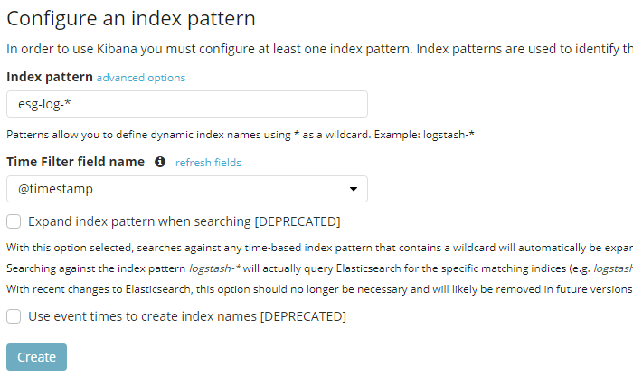

# ESG
Testing alternative version og ELK stack, with Elasticsearch, Serilog and Grafana

## Logins
For logging into the various apps, the following credentials are needed:

### Elasticsearch

+ username: 'elastic'
+ password: 'changeme'

### Grafana

+ username: 'changeme'
+ password: 'admin'

### Kibana

+ username: 'elastic'
+ password: 'changeme'

## Visualizer setup
Both Grafana and Kibana need certain setups before being able to fetch data.

### Grafana datasource setup
The image below shows the used setup of datasource in Grafana:

### Kibana index setup
The Kibana index setup:

